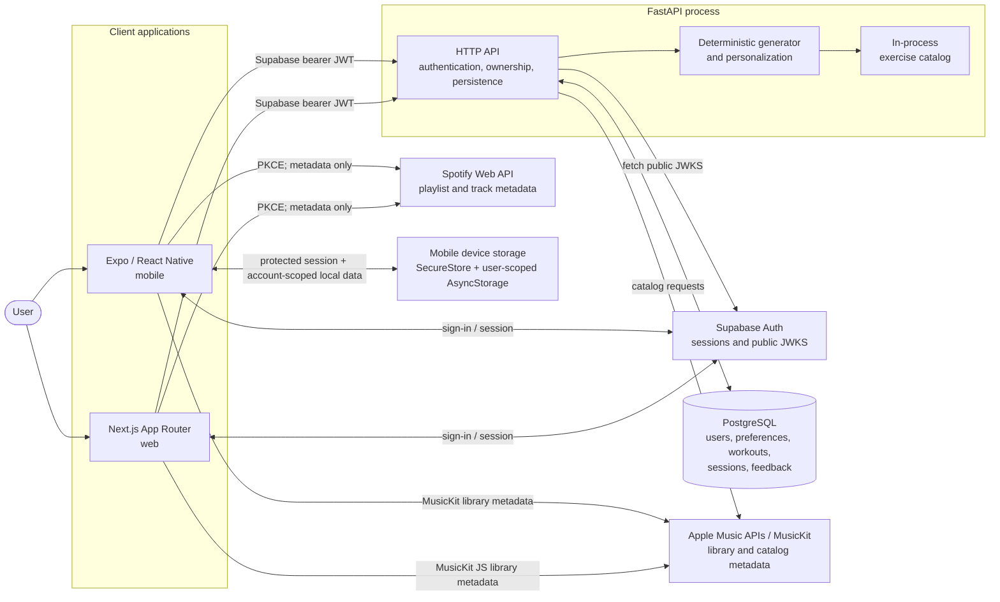
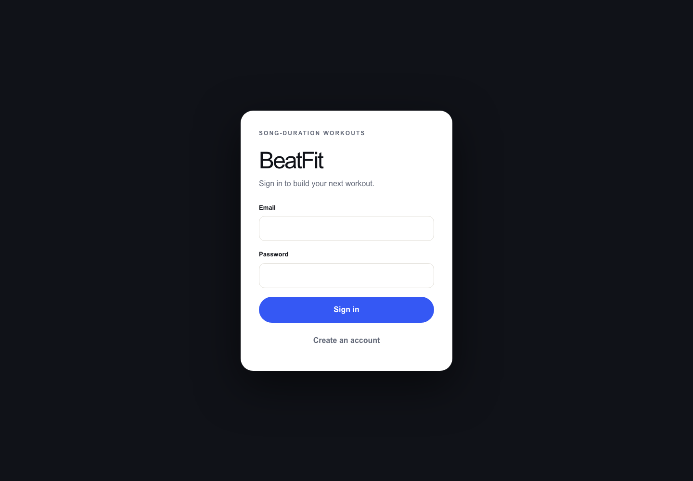

# BeatFit

[](https://github.com/WonChung/beatfit/actions/workflows/ci.yml)

BeatFit is a cross-platform workout application that turns song durations and
user preferences into timed interval routines. The monorepo combines an Expo /
React Native mobile client, a Next.js web client, and a FastAPI service backed by
PostgreSQL.

Workout generation and personalization use deterministic, explainable rules.
BeatFit does not use or claim AI. Apple Music and Spotify integrations provide
metadata and track selection only; there is no synchronized or in-app music
playback.

## Engineering focus

The repository is designed to demonstrate more than a UI flow:

- A FastAPI service with explicit domain, persistence, authentication,
  personalization, provider, and observability boundaries.
- PostgreSQL models and versioned Alembic migrations, exercised in CI against a
  real PostgreSQL 17 service.
- Supabase JWT verification with issuer, audience, time, role, and subject
  validation; resource ownership comes from the verified subject rather than a
  client-supplied user ID.
- Deterministic, seedable workout generation that produces contiguous intervals
  matching each song's duration, with bounded API inputs and an in-process
  70-exercise catalog.
- Conservative personalization based on stored preferences and recent feedback,
  while equipment, avoided exercises, impact, muscle group, and goal remain hard
  constraints.
- Immutable workout snapshots on completed sessions so historical records do not
  depend on a later mutation or deletion of the source workout.
- Structured request logging, safe error responses, request IDs, process
  liveness, database readiness, and fail-closed production configuration checks.
- Client-side provider adapters that keep Spotify refresh tokens and Apple Music
  user authorization outside FastAPI.

## Product surface

| Component | Implemented behavior |
| --- | --- |
| Mobile | Authenticated setup, personalized generation, preview, timestamp-based timer, completion feedback, account-scoped local saves/history, preferences, provider metadata selection, and bundled exercise visuals. |
| Web | Authenticated dashboard, setup and generation, preview, timestamp-based timer, server-backed completion feedback, preferences, exercise demonstrations, and optional provider metadata selection. |
| Backend | Exercise catalog, deterministic generation and personalization, JWT verification, ownership-scoped persistence, Apple developer-token/catalog endpoints, request observability, and health/readiness endpoints. |

## Architecture



Supabase owns account sessions. FastAPI verifies the access token, synchronizes a
local user record, and applies the verified subject to every owned database
query. Neither client connects directly to PostgreSQL.

Spotify authorization uses Authorization Code with PKCE in each client; no
Spotify client secret exists in the repository or client configuration. Mobile
tokens use protected device storage and web tokens use per-tab
`sessionStorage`. For Apple Music, FastAPI keeps developer-token signing material
server-side, while Music User Tokens remain managed by MusicKit and are never
sent to FastAPI. The mobile logical Apple connection is also scoped to the
authenticated BeatFit account. The web adapter records a per-tab BeatFit owner,
rechecks it around MusicKit operations, and invalidates inherited authorization
on logout or account change.

On native mobile, Supabase session data is stored through `expo-secure-store`,
including migration from the earlier AsyncStorage adapter. Generated workouts,
named saves, and local history remain device-local in user-keyed AsyncStorage
namespaces. Those workout records are account-isolated but not encrypted.

## Demo



_The web authentication entry point. The repository does not currently claim a
hosted deployment or public live demo._

## Repository layout

```text
apps/mobile/  Expo Router mobile application and local iOS MusicKit module
apps/web/     Next.js App Router web application
backend/      FastAPI application, SQLAlchemy models, Alembic migrations, Compose
docs/         Provider architecture, build guidance, and portfolio assets
```

The root `Makefile` coordinates the independently locked mobile and web npm
projects plus the backend virtual environment. The monorepo does not require a
JavaScript workspace manager.

## Prerequisites

- Node.js 22 and npm
- Python 3.13 or newer
- GNU Make
- PostgreSQL 17, or Docker with Compose for the included local database
- A Supabase project for authenticated application flows

Apple Music and Spotify accounts and developer configuration are optional.
Leave their feature flags disabled to use the manual song-metadata flow.

## First-time setup

Create local environment files from the tracked, non-secret examples:

```bash
cp backend/.env.example backend/.env
cp apps/mobile/.env.example apps/mobile/.env.local
cp apps/web/.env.example apps/web/.env.local
```

Review every value before starting the applications. Never put production
credentials in these files or commit them.

Install the backend development dependencies and both npm projects from their
lockfiles:

```bash
make setup
```

Start the PostgreSQL-only Compose service and apply migrations:

```bash
cd backend
docker compose up -d postgres
set -a
source .env
set +a
.venv/bin/alembic upgrade head
cd ..
```

The first Compose initialization creates separate `beatfit` and `beatfit_test`
databases. An existing PostgreSQL installation can be used by changing
`DATABASE_URL` and `TEST_DATABASE_URL`. The test database guard requires an
explicit PostgreSQL test database and refuses a target that resolves to the
development database.

## Environment configuration

The three `.env.example` files are the source of truth for supported variables.

| Location | Variables | Notes |
| --- | --- | --- |
| Backend | `APP_ENV`, `LOG_LEVEL`, `CORS_ALLOWED_ORIGINS`, `CORS_ALLOW_CREDENTIALS` | Production mode validates configuration at startup. Production origins must be explicit HTTPS origins. |
| Backend | `DATABASE_URL`, `TEST_DATABASE_URL` | SQLAlchemy PostgreSQL URLs. Tests require an isolated, clearly test-scoped database when this variable is set. |
| Backend | `SUPABASE_URL`, `SUPABASE_JWT_ISSUER`, `SUPABASE_JWT_AUDIENCE`, `SUPABASE_JWKS_URL` | Public JWT-verification configuration; no Supabase service-role key is required. |
| Backend | `APPLE_MUSIC_*` | Developer-token signing and catalog configuration. The `.p8` path or PEM value is backend-only. |
| Mobile | `EXPO_PUBLIC_API_BASE_URL`, `EXPO_PUBLIC_SUPABASE_*`, provider feature flags and client IDs | Every `EXPO_PUBLIC_` value is embedded in the client and must be non-secret. |
| Web | `NEXT_PUBLIC_API_BASE_URL`, `NEXT_PUBLIC_SUPABASE_*`, provider feature flags and client IDs | Every `NEXT_PUBLIC_` value is browser-visible and must be non-secret. |

Supabase service-role keys, Apple private keys, database credentials, Spotify
client secrets, access tokens, refresh tokens, and Music User Tokens must never
be placed in public client variables. A physical mobile device must use a
reachable LAN or HTTPS API URL rather than its own `127.0.0.1`.

## Run locally

Export the backend environment in the shell that starts FastAPI:

```bash
set -a
source backend/.env
set +a
```

Then run each application in a separate terminal:

```bash
make run-backend  # FastAPI: http://127.0.0.1:8000
make run-mobile   # Expo development server
make run-web      # Next.js: http://localhost:3000
```

FastAPI exposes OpenAPI documentation at `http://127.0.0.1:8000/docs`.
`GET /health` is dependency-free process liveness; `GET /ready` verifies
database connectivity.

## Validation

Run the core local suite from the repository root:

```bash
make lint
make typecheck
make test
make build-web
make check
```

Validate the additional repository and mobile build boundaries used by CI:

```bash
docker compose -f backend/compose.yaml config --quiet
backend/.venv/bin/pip-audit -r backend/requirements.txt
npm --prefix apps/mobile run verify:native-module
npm --prefix apps/mobile run export:ios
```

The autolinking check confirms that the checked-in BeatFit Apple Music module is
discoverable for Apple platforms and remains excluded from Android until its
native bridge exists. An Expo export verifies JavaScript and asset bundling; it
does not compile Swift or replace a signed-device build.

To exercise persistence against PostgreSQL rather than the SQLite fallback:

```bash
cd backend
set -a
source .env
set +a
APP_ENV=test .venv/bin/pytest -q
.venv/bin/alembic current
.venv/bin/alembic check
```

Never point `TEST_DATABASE_URL` at a development or production database.

## Continuous integration

The CI workflow runs for every pull request and push to `main` with read-only
repository permission and no Supabase or music-provider credentials:

- Backend: dependency consistency and vulnerability audit, Ruff lint/format
  checks, Alembic upgrade/current/drift validation, and pytest against an
  isolated PostgreSQL 17 service.
- Mobile: npm dependency audit, ESLint, TypeScript, Jest, Apple native-module
  autolinking validation, and an iOS Expo export.
- Web: npm dependency audit, ESLint, TypeScript, Vitest, and a production Next.js
  build.

When the repository is public, the separate dependency-review workflow rejects
pull requests that introduce known moderate-or-higher dependency
vulnerabilities. GitHub does not expose that action to an ordinary private
personal repository, so the job is skipped while this repository is private.
Dependabot checks Python, both npm applications, and GitHub Actions weekly.

The badge at the top reflects the latest workflow run available on GitHub. It
becomes authoritative for changes in a local worktree only after those changes
are pushed and the `main` workflow completes.

## API and persistence model

The public `POST /workouts/generate` endpoint produces a bounded,
non-personalized workout without persistence. Authenticated clients normally use
`POST /workouts/generate/personalized`, which applies owned preferences and
feedback history and persists the generated workout.

Authenticated endpoints cover:

- owned workouts and immutable session snapshots;
- completed or ended-early workout sessions and feedback;
- durable account preferences and personalization-history reset;
- Apple developer-token issuance and normalized public catalog search.

Exercise IDs, provider identifiers, song metadata, interval timelines, and
personalization explanations are preserved in typed API models. See
[the backend guide](backend/README.md) for the endpoint matrix, schemas,
ownership behavior, migrations, and reset procedures.

## Security model

- FastAPI accepts Supabase bearer tokens signed with the configured asymmetric
  algorithms and validates their issuer, audience, timestamps, subject, and
  authenticated role.
- Owned resource queries derive the user ID from the verified token and return
  the same not-found response for missing and cross-user records.
- Production startup rejects unsafe CORS, loopback/example database
  configuration, and incomplete Supabase verification settings.
- The API rejects request bodies above 1 MiB before JSON model parsing, and
  bounded request models cap generation and persistence work.
- Request logs omit headers, bodies, query strings, credentials, provider
  tokens, and raw exception messages. User-facing failures avoid stack traces.
- Spotify uses PKCE and account-bound client storage. Apple private signing
  material stays in FastAPI; Apple logical connection metadata and native
  Supabase sessions use protected mobile storage.
- Local environment files, native signing artifacts, private keys, generated
  builds, dependency trees, and IDE state are ignored by Git.
- Dependency review, Dependabot, and the repository
  [security policy](.github/SECURITY.md) document the remaining repository
  controls and disclosure process.

## Honest limitations

- Apple Music and Spotify are metadata/catalog integrations only. BeatFit does
  not play music in-app and does not synchronize playback with workout
  intervals.
- Generation and personalization are deterministic rules, not AI, an LLM, audio
  analysis, BPM detection, beat detection, or a recommendation model.
- Apple library browsing currently loads only the first playlist/track page, and
  neither client exposes the backend Apple catalog-search endpoint. The native
  Apple Music bridge is iOS-only; Android remains unsupported.
- Web active-workout state depends on the current browser page and does not
  provide the mobile client's complete saved-workout/history experience.
- Mobile workout/history payloads are account-scoped but remain unencrypted,
  device-local AsyncStorage data. They are not a complete cross-device cache.
- Timers reconcile from timestamps, but a mobile JavaScript process or browser
  tab is not a background workout service.
- Bundled exercise silhouettes and pose transitions are illustrative
  placeholders, not complete technique or safety instruction.
- Provider access depends on external subscriptions, permissions, dashboard
  configuration, and development-mode restrictions.
- Application-level rate limiting is not implemented; a public production API
  should enforce abuse controls at its ingress or API gateway.
- The repository provides a PostgreSQL development Compose service but does not
  claim a hosted deployment. Managed infrastructure, deployment automation,
  backups, TLS, monitoring/alerting, domains, and release procedures remain
  outside the checked-in implementation.

## Documentation

- [Documentation index](docs/README.md)
- [Backend API and database](backend/README.md)
- [Mobile application](apps/mobile/README.md)
- [Web application](apps/web/README.md)
- [Apple Music architecture](docs/apple-music-plan.md)
- [Apple Music build configuration](docs/apple-music-build-setup.md)
- [Spotify metadata integration](docs/spotify-integration.md)
- [Security policy](.github/SECURITY.md)
- [Mobile exercise visuals](apps/mobile/assets/exercises/README.md)
- [Mobile exercise animations](apps/mobile/assets/exercise-animations/README.md)
- [Web exercise animations](apps/web/public/exercise-animations/README.md)

## License status

No repository-wide software license has been selected. The former Expo template
license was removed because it described Expo's copyright rather than granting
terms for BeatFit. Choose and add the intended license before inviting reuse or
external contributions.
