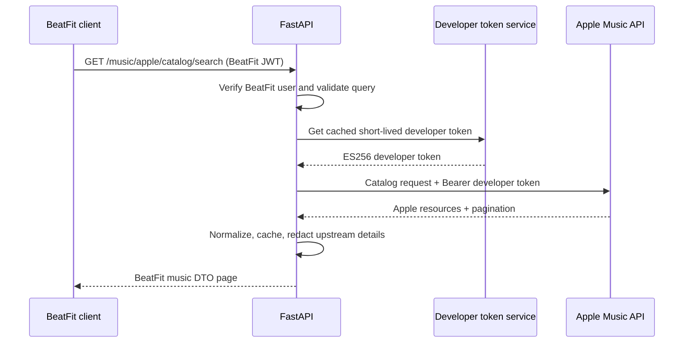
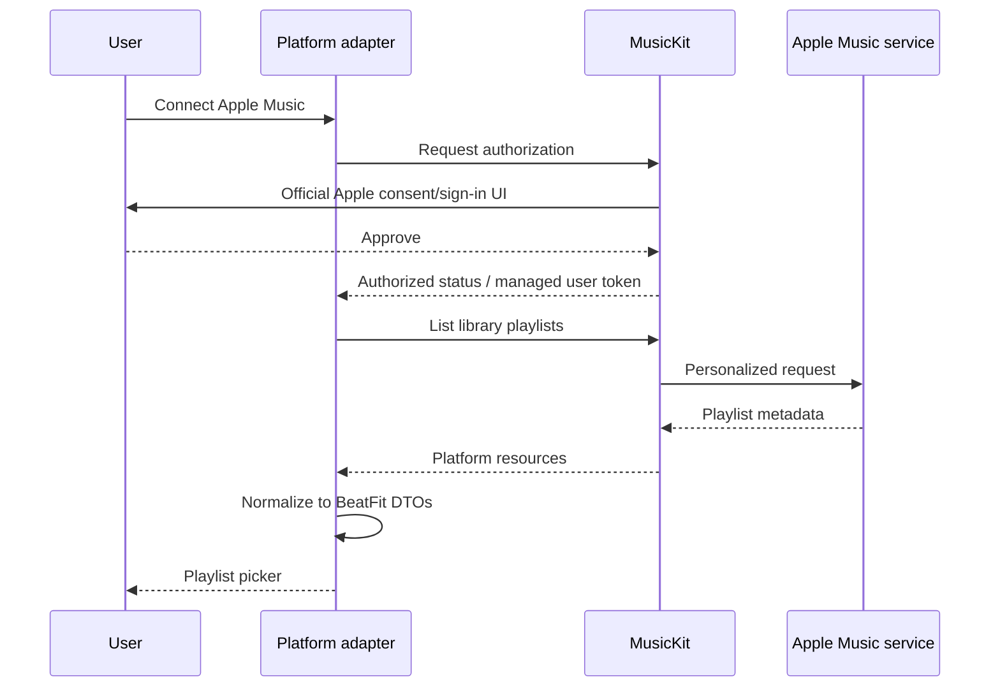
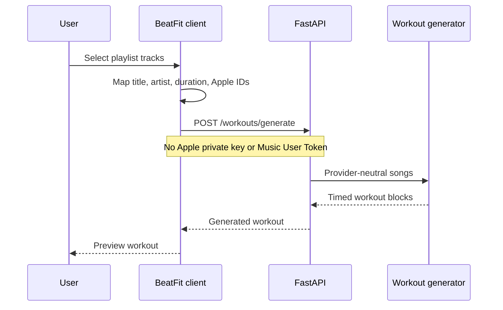
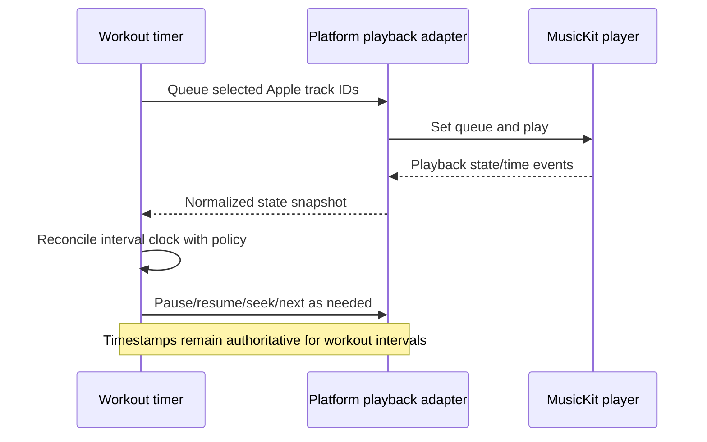

# BeatFit Apple Music Integration Plan

Status: Phase A/B implemented for backend, web, and iOS; Android bridge and
Phase C/D remain design/backlog work

Last reviewed: 2026-07-12

## Executive conclusion

BeatFit should use one provider-neutral TypeScript contract with three real
platform adapters:

1. iOS: a custom Expo native module backed by MusicKit for Swift.
2. Android: a custom Expo native module backed by Apple's MusicKit Android
   authentication and playback libraries.
3. Web: MusicKit on the Web, loaded only in browser components.

FastAPI should own Apple developer-token signing and public catalog proxying.
The Apple Media Services `.p8` private key must never enter Expo, Next.js
browser code, a mobile binary, source control, logs, or a client environment
variable.

Expo Go cannot load either custom native adapter. It can still exercise public
catalog or playlist metadata returned by FastAPI and the complete
metadata-to-workout flow with mocked/provider-neutral records. Personalized
Apple Music library authorization and playback require an Expo development
build on mobile. The web adapter does not require a native build.

Playlist and song metadata should be delivered before playback. BeatFit's
existing generator already accepts provider-neutral title, artist, and duration
data; add Apple catalog IDs and artwork as optional metadata rather than making
generation depend on playback.

## Current repository fit

- Mobile is Expo SDK 57 with Expo Router, stable `com.beatfit.mobile` iOS and
  Android identifiers, `NSAppleMusicUsageDescription`, a provider service, and
  a working local Expo MusicKit module on iOS. Expo Go cannot load that native
  module. Android currently has TypeScript, Expo-module declaration, and Gradle
  scaffolding only; its native bridge is not checked in and also requires
  Apple's licensed Authentication SDK AAR.
- Web is Next.js 16 App Router with authenticated server/client boundaries.
- Web has a client-only MusicKit JS adapter, connect/disconnect and playlist
  selection UI, and fetches developer tokens only from authenticated FastAPI.
- FastAPI verifies the BeatFit user, signs and caches short-lived developer
  tokens, validates web origins, and proxies normalized public catalog search.
- PostgreSQL records are scoped by the verified BeatFit user.
- Workout input/output and persistence models carry provider-neutral song
  title, artist, duration, artwork, and optional Apple provider identifiers.
- Phase A/B selection-to-generation is implemented on web and iOS with mocked
  tests; Android remains incomplete. Playback, queue control, background audio,
  and player/timer synchronization are not implemented.

Manual setup for the implemented baseline is documented in the
[Phase A/B build guide](apple-music-build-setup.md). Backend setup and endpoint
details are in the [backend guide](../backend/README.md#apple-music-metadata-api).

## Apple concepts and trust boundaries

### Developer token

Every Apple Music API request requires a developer token. Apple requires ES256
and the `kid`, Team ID (`iss`), `iat`, and `exp` values. Apple limits `exp` to at
most 15,777,000 seconds (six months), but BeatFit should issue much shorter-lived
tokens and cache them server-side. Web-facing tokens should include Apple's
recommended `origin` restriction.

The token is signed with a Media Services private key. The signed token may be
delivered to MusicKit on the Web or an Android adapter; the private key may not.
MusicKit for Swift can use Apple's automatic developer-token management for
native requests, but FastAPI still needs its own developer token for catalog
proxy endpoints.

### Music User Token

A Music User Token authorizes subscriber-specific operations such as reading a
person's library playlists. It is distinct from the BeatFit Supabase session.

- iOS: MusicKit automatically manages it after `MusicAuthorization` succeeds.
- Web: MusicKit on the Web automatically decorates personalized API requests
  after `authorize()` succeeds.
- Android: Apple's SDK returns a Music User Token explicitly; its lifecycle is
  the Android adapter's responsibility.

The preferred design keeps Music User Tokens inside each platform adapter.
Clients send normalized song metadata and Apple IDs to BeatFit, not the user
token. If a future backend endpoint truly needs personalized Apple API access,
store the token encrypted, keyed to the verified BeatFit user, with revocation
and deletion support. Do not put it in ordinary AsyncStorage or browser-readable
application state.

## Architecture proposal

```text
                        +--------------------------+
                        | Apple Music API / service|
                        +------------+-------------+
                                     ^
                 public catalog      |       personalized / playback
                 developer token     |
                                     |
+-------------+   BeatFit JWT   +-----+------+    +------------------------+
| Mobile/Web  +---------------->+  FastAPI   |    | Platform MusicKit      |
| shared UI   |<----------------+ catalog API|    | iOS / Android / Web    |
+------+------+ normalized data +-----+------+    +-----------+------------+
       |                                   ^                   ^
       | AppleMusicAdapter                 |                   |
       +-----------------------------------+-------------------+
```

The implemented Phase A/B service contract contains authorization,
disconnect, playlist pagination, and playlist-track pagination. Phase C/D can
extend that provider boundary toward the following target without putting
MusicKit details into workout screens:

```ts
interface AppleMusicAdapter {
  capabilities(): AppleMusicCapabilities;
  authorizationStatus(): Promise<AppleMusicAuthorizationStatus>;
  authorize(): Promise<AppleMusicAuthorizationStatus>;
  unauthorize(): Promise<void>;
  listLibraryPlaylists(page?: string): Promise<Page<MusicPlaylist>>;
  getPlaylistTracks(id: string, page?: string): Promise<Page<MusicTrack>>;
  setQueue(tracks: MusicTrack[]): Promise<void>;
  play(): Promise<void>;
  pause(): Promise<void>;
  seek(seconds: number): Promise<void>;
  subscribe(listener: (event: PlaybackEvent) => void): () => void;
}
```

Use discriminated provider identifiers rather than treating Apple IDs as BeatFit
record IDs:

```ts
type ProviderTrackRef = {
  provider: "apple_music";
  catalogId: string;
  libraryId?: string;
  storefront: string;
};
```

Catalog IDs are storefront-sensitive. Preserve the storefront alongside IDs,
and expect library IDs to differ from catalog IDs.

### Backend responsibilities

- Generate and cache short-lived Apple developer tokens.
- Keep the `.p8` key in a production secret manager.
- Proxy/cache public catalog search and resource metadata.
- Return a short-lived, origin-restricted developer token to the authenticated
  web client when MusicKit JS needs one.
- Normalize Apple API responses into BeatFit music DTOs.
- Apply rate limits, timeouts, pagination, and safe Apple error translation.
- Never accept a BeatFit ownership ID from a client.
- Avoid receiving Music User Tokens in Phases A-C unless a documented endpoint
  cannot be implemented with the platform adapter.

### Client responsibilities

- Obtain user consent through the official platform MusicKit UI.
- Read personalized library metadata through its adapter.
- Send only selected track metadata and provider references to workout
  generation.
- Own playback and playback event delivery.
- Present unsupported/subscription/authorization states distinctly.

## Platform comparison

This table describes the intended capability of each approved adapter. The
Android column remains a target architecture until its native bridge and
licensed SDK dependencies are implemented.

| Capability | Expo Go (native) | iOS development build | Android development build | Next.js web |
|---|---|---|---|---|
| FastAPI-proxied public catalog metadata | Yes | Yes | Yes | Yes |
| Provider-neutral/mock playlist metadata | Yes | Yes | Yes | Yes |
| User's Apple Music playlists | No official native path | Yes, through MusicKit for Swift | Yes, through Android authentication token and API | Yes, after MusicKit JS authorization |
| Apple Music authorization UI | No | Native `MusicAuthorization` | Native Apple authentication SDK | `MusicKit.authorize()` in browser |
| Full Apple Music playback | No | Native MusicKit player | Android Media Playback SDK | MusicKit on the Web player |
| Background/lock-screen playback | No | Native audio-session/player work required | Native service/player work required | Browser/platform dependent; not reliable like native |
| Custom native code | Not loadable | Required | Required | Not applicable |
| Simulator/emulator confidence | Metadata only; playback is not representative | Test on a signed physical device | Test on a physical device with Apple Music support | Supported browser plus real subscriber account |

### Clear Expo Go conclusion

Expo Go contains a fixed native runtime and cannot include a BeatFit MusicKit
Swift bridge or Apple's Android SDK. Therefore:

- Phase A public catalog metadata can run in Expo Go through FastAPI.
- UI, normalization, selection, pagination, and workout generation can be built
  and tested in Expo Go using public or mocked metadata.
- Subscriber authorization, personal playlists, Music User Token acquisition,
  subscription checks, and playback cannot be considered supported in Expo Go.
- Do not use MusicKit JS inside a native WebView as a workaround; it creates a
  fourth, unofficial mobile runtime with poor authorization and playback
  lifecycle semantics.

## Native requirements

### iOS

1. Choose and configure a stable explicit bundle identifier in Expo config.
2. Register the matching explicit App ID in Certificates, Identifiers &
   Profiles and enable the MusicKit App Service.
3. Regenerate development/distribution provisioning profiles after changing
   the App ID service.
4. Add `NSAppleMusicUsageDescription` with a user-facing reason. Apple states
   that the system terminates an app that attempts access without the required
   purpose string.
5. Add a local Expo config plugin/native module that links MusicKit and exposes
   authorization, library, subscription, player, queue, and event APIs.
6. Let Xcode/EAS managed signing apply the capabilities associated with the App
   ID. Do not invent or manually hardcode an undocumented entitlement key;
   inspect the generated signed entitlements and provisioning profile.
7. Configure the audio session/background audio modes only in Phase C if product
   requirements include continued playback while locked or backgrounded.
8. Validate on a signed physical device and an Apple Music subscriber account.

iOS authorization is a system permission flow, not an OAuth redirect flow. No
web callback URL is required for `MusicAuthorization.request()`.

### Android

1. Choose a stable Android application ID in Expo config.
2. Add Apple's current MusicKit Android Authentication SDK for Phase A and Media
   Playback SDK for Phase C through a custom Expo native module/config plugin.
3. Implement the authentication Intent flow and return its result through the
   native module. The SDK can prompt for Apple Music sign-in and can direct the
   user to install Apple Music when absent.
4. Implement Apple's `TokenProvider`: obtain the developer token from FastAPI
   and keep the returned Music User Token in platform secure storage.
5. Verify the final merged Android manifest after adding Apple's libraries.
   Declare only activities/services/permissions required by the installed SDK
   release and playback design; do not guess them in Expo config beforehand.
6. Add lifecycle cleanup, Activity result handling, and playback service/media
   session integration for Phase C.
7. Validate on physical Android devices, including with Apple Music missing,
   installed but signed out, signed in without a subscription, and subscribed.

The Android authentication SDK uses an Intent/result flow rather than a web
redirect URL managed by BeatFit. No BeatFit OAuth callback endpoint is proposed.

### Web

1. Load Apple's hosted MusicKit JS script in a client-only boundary.
2. Fetch a short-lived developer token from authenticated FastAPI immediately
   before `MusicKit.configure`.
3. Put the production and approved development origins in the developer token's
   `origin` claim.
4. Call `MusicKit.authorize()` only from a direct user gesture and handle popup,
   cookie, content-restriction, storefront, and subscription failures.
5. Let MusicKit JS manage the Music User Token and decorate personalized
   requests; do not copy it to Next.js cookies or local storage.
6. Keep MusicKit globals/player code out of Server Components. Server-render
   only non-sensitive shells and provider-neutral persisted selections.

Apple's MusicKit authorization flow does not require a Sign in with Apple
Services ID or a BeatFit OAuth redirect URI. It is separate from BeatFit's
Supabase authentication. Web deployments still need a stable HTTPS origin for
the token origin restriction and reliable browser authorization behavior.

## Required Apple Developer configuration

### Shared media-service configuration

- Active Apple Developer Program membership.
- One Media ID for BeatFit, using a reverse-domain identifier. Its description
  is displayed to users during Apple Music access authorization.
- MusicKit enabled for that Media ID.
- One Media Services private key associated with the Media ID.
- Record the Apple Team ID and ten-character Key ID.
- Maintain a second eligible key slot for zero-downtime rotation; Apple allows
  two keys per media identifier.

### iOS configuration

- Explicit App ID matching the final Expo iOS bundle identifier.
- MusicKit App Service enabled on the App ID.
- Updated provisioning profiles/signing.
- `NSAppleMusicUsageDescription`.
- Generated native MusicKit bridge and capability configuration.

### Android configuration

- Stable application ID.
- Apple MusicKit Authentication library; Playback library in Phase C.
- Native Intent/result bridge and secure token storage.
- SDK-required manifest components verified from the current downloaded SDK.
- No Apple App ID or iOS entitlement applies to the Android package.

### Web configuration

- Stable HTTPS production origin.
- Development origins explicitly listed in development developer tokens.
- Apple's hosted MusicKit JS.
- No Sign in with Apple identifier and no separate callback URL for MusicKit.

## Required environment variables

Backend secret/runtime configuration:

```env
APPLE_MUSIC_TEAM_ID=YOUR10CHARTEAMID
APPLE_MUSIC_KEY_ID=YOUR10CHARKEYID
APPLE_MUSIC_MEDIA_ID=com.example.beatfit.music
APPLE_MUSIC_PRIVATE_KEY_PATH=/run/secrets/apple_music_key.p8
APPLE_MUSIC_DEVELOPER_TOKEN_TTL_SECONDS=3600
APPLE_MUSIC_API_BASE_URL=https://api.music.apple.com
APPLE_MUSIC_WEB_ORIGINS=https://beatfit.example,http://localhost:3000
```

Prefer a secret-manager value such as `APPLE_MUSIC_PRIVATE_KEY_PEM` over a file
path only when the deployment platform injects multiline secrets safely. Never
define either private-key variable with `EXPO_PUBLIC_` or `NEXT_PUBLIC_`.

Optional non-secret client configuration:

```env
EXPO_PUBLIC_APPLE_MUSIC_ENABLED=false
NEXT_PUBLIC_APPLE_MUSIC_ENABLED=false
NEXT_PUBLIC_APPLE_MUSIC_DEFAULT_STOREFRONT=us
```

Do not configure developer tokens or Music User Tokens as static environment
variables in clients. Developer tokens are fetched when needed; user tokens are
managed by MusicKit or secure native storage.

## API sequences

### Public catalog metadata



### Personalized playlist authorization and metadata



On Android, the adapter explicitly supplies the developer token and receives
the Music User Token; on iOS and web, MusicKit manages the user token.

### Select tracks and generate a workout



### Playback and timer synchronization



## Delivery phases and backlog

### Phase A — authorization and playlist metadata

Implementation status: baseline delivered on iOS and web, with mocked-provider
coverage. Both require live Apple configuration for manual acceptance. Android
still needs the licensed Authentication SDK AAR and a native authorization and
library bridge before it can be tested.

- Register Media ID/key and iOS App ID service.
- Build the backend developer-token service with rotation-ready key loading.
- Add authenticated public catalog search/resource endpoints.
- Define provider-neutral music DTOs, pagination, storefront, explicit-content,
  subscription, and error states.
- Build adapter contracts and mock/catalog-only adapter for Expo Go.
- Build iOS authorization/library metadata bridge.
- Build Android authentication/token bridge and secure token storage.
- Load/configure MusicKit JS and authorize on web.
- List library playlists and paginated tracks without playback.
- Add connect/disconnect UI and privacy copy.

Exit criterion: an authenticated BeatFit user can connect Apple Music on each
supported real platform, browse playlists/tracks, and disconnect. Expo Go can
browse public/mock metadata only. The phase-wide criterion remains open for
Android.

### Phase B — selecting songs and generating workouts

Implementation status: baseline delivered for the web and iOS Apple adapters.
Selected playable tracks are normalized to BeatFit songs with duration,
artwork, and Apple provider IDs, then passed to existing multi-song generation.
Android and refreshing stale saved metadata remain future work.

- Add multi-track selection, ordering, duration totals, and duplicate handling.
- Preserve Apple catalog/library IDs and storefront in saved workout snapshots.
- Convert Apple durations to existing millisecond song inputs.
- Validate unavailable, explicit, missing-duration, and storefront-mismatched
  tracks.
- Generate, preview, save, repeat, and restore workouts without playback.
- Decide how stale metadata is refreshed without invalidating saved workouts.

Exit criterion: Apple playlist selections produce deterministic BeatFit workout
blocks while the current manual-song flow remains available.

### Phase C — playback

Implementation status: not implemented.

- Add queue/play/pause/resume/seek/skip APIs to each adapter.
- Implement subscription and playability checks before starting.
- Integrate iOS MusicKit playback and audio-session behavior.
- Integrate Android Media Playback, media session, notification, and lifecycle.
- Integrate MusicKit on the Web player and user-gesture autoplay handling.
- Add playback-specific UI states and graceful fallback to timer-only workouts.
- Test interruption, headphones, phone calls, route changes, and denied access.

Exit criterion: a selected track queue plays under BeatFit controls on supported
devices/browsers, independently of interval synchronization.

### Phase D — playback-state synchronization

Implementation status: not implemented.

- Define whether the workout clock or music playback is authoritative for each
  control and interruption.
- Normalize player events into monotonic snapshots.
- Reconcile drift using timestamps; do not seek on every timer tick.
- Define policies for buffering, user scrubbing, external play/pause, track
  unavailability, route loss, app backgrounding, and remote controls.
- Persist resumable state without persisting reusable Apple credentials.
- Add telemetry that excludes tokens and sensitive library data.

Exit criterion: interval transitions and song-block transitions remain correct
through pause/resume, buffering, foreground restoration, and external player
events within documented tolerances.

## Security risks and controls

| Risk | Control |
|---|---|
| `.p8` private key exposure | Store only in a backend secret manager; restrict service-account access; never copy into repo, image layer, mobile build, Next public env, CI logs, or crash reports. |
| Long-lived developer-token replay | Use short TTLs, cache server-side, add web `origin`, rate-limit token issuance, rotate keys, and revoke a compromised key only after the replacement is deployed. |
| Music User Token theft | Prefer MusicKit-managed storage; use iOS Keychain/Android Keystore-backed storage when manual; never ordinary AsyncStorage, logs, analytics, URLs, or Redux/devtools. |
| Cross-user token/data access | Bind any server-stored credential to the verified Supabase user; include owner filters on every query; return not-found for other owners; test with two accounts. |
| Sensitive logging | Redact `Authorization`, `Music-User-Token`, developer tokens, library IDs where unnecessary, request URLs containing personal IDs, and raw Apple error bodies. |
| Token leakage through browser | Never expose signing keys; return only short-lived origin-restricted developer tokens; keep user tokens under MusicKit JS management; apply CSP to Apple script/API origins. |
| Stale/revoked authorization | Treat 401/403 as connection invalidation, clear platform credentials, require explicit reauthorization, and provide disconnect/delete controls. |
| Excessive library collection | Persist only selected track references and workout snapshots; do not mirror a user's entire library by default. |

Developer-token generation belongs in FastAPI or a dedicated server-side token
service, never in Next.js client code or mobile code. The private key should be
downloaded once, backed up in an approved secrets system, and removed from local
Downloads after secure import. Apple cannot provide the same file again.

## Testing strategy

### Unit tests

- ES256 token headers/claims, TTL bounds, origin restrictions, cache refresh,
  clock skew, and key-rotation selection.
- Apple response normalization, duration conversion, storefront preservation,
  explicit-content handling, pagination, and malformed resources.
- Adapter capability detection and unsupported Expo Go behavior.
- Selection-to-workout request mapping without credentials in payloads.
- Playback event reducer and Phase D reconciliation policies.

Use a generated test EC key; never use the real Apple `.p8` in tests.

### Backend integration tests

- Mock Apple HTTP at the transport boundary for 200, pagination, 401, 403, 404,
  429, 5xx, timeout, and invalid JSON.
- Verify BeatFit authentication, rate limiting, cache partitioning, and error
  redaction.
- Verify no client can request another BeatFit user's stored connection.
- Add a manually triggered sandbox/live smoke test that never runs in pull
  requests and never prints tokens.

### Native tests

- iOS physical-device matrix: permission states, subscriber states, storefront,
  interruption, background/foreground, remote controls, and revoked access.
- Android physical-device matrix: Apple Music absent/installed, signed out,
  non-subscriber/subscriber, activity recreation, process death, and playback
  service lifecycle.
- Build-time tests for config plugin idempotence, purpose string, app IDs,
  provisioning capability, linked frameworks/AARs, and merged manifest.
- Expo Go explicitly reports metadata-only capability rather than crashing or
  showing unusable authorization controls.

### Web tests

- Mock MusicKit global for authorization, playlist pagination, playback events,
  and unauthorize.
- Verify MusicKit is never evaluated during server rendering.
- Test popup blocked, third-party-cookie restrictions, autoplay rejection,
  subscriber errors, and supported Safari/Chromium configurations.
- Inspect production bundles/environment output to ensure no private key or
  static user token is present.

### End-to-end acceptance

- Connect Apple Music, select multiple playlist tracks, generate a workout,
  preview/save/repeat it, disconnect, and confirm the manual-song path still
  works.
- Run two BeatFit users on the same test environment and prove their Apple state
  and selected workout data cannot cross.

## Known platform limitations

- Apple Music authorization is separate from BeatFit/Supabase authentication.
- Personalized data and full playback generally require an active Apple Music
  subscription and a supported storefront; authorization alone is insufficient.
- Not every catalog item is playable in every storefront, and library IDs are
  not interchangeable with catalog IDs.
- Expo Go cannot load the native MusicKit adapters.
- iOS simulator and Android emulator behavior is not sufficient evidence for
  subscription authorization or playback; physical-device coverage is required.
- Web playback is subject to browser autoplay, popup, cookie, media-session,
  background-tab, and DRM behavior.
- Web background playback and native lock-screen behavior are not equivalent.
- Android user-token management is manual, unlike iOS and web.
- Apple API pagination and rate limits require incremental loading and backoff.
- Developer-token JWTs can be valid for up to six months, but that maximum is
  inappropriate for routine web delivery.
- Playback timing events may buffer or arrive late. BeatFit's timestamp-based
  workout timer should remain independent until Phase D defines reconciliation.

## Official sources

Research for this plan was limited to current official Apple material:

- [MusicKit overview](https://developer.apple.com/musickit/)
- [MusicKit framework](https://developer.apple.com/documentation/musickit)
- [User Authentication for MusicKit](https://developer.apple.com/documentation/applemusicapi/user-authentication-for-musickit)
- [Generating Developer Tokens](https://developer.apple.com/documentation/applemusicapi/generating-developer-tokens)
- [MusicKit App Service configuration](https://developer.apple.com/help/account/services/musickit)
- [Create a media identifier and private key](https://developer.apple.com/help/account/capabilities/create-a-media-identifier-and-private-key/)
- [Create a private key to access a service](https://developer.apple.com/help/account/keys/create-a-private-key/)
- [`NSAppleMusicUsageDescription`](https://developer.apple.com/documentation/bundleresources/information-property-list/nsapplemusicusagedescription)
- [`MusicAuthorization.request()`](https://developer.apple.com/documentation/musickit/musicauthorization/request())
- [MusicKit on the Web](https://js-cdn.music.apple.com/musickit/v3/docs/index.html)
- [MusicKit Android API overview](https://developer.apple.com/musickit/android/overview-summary.html)
- [Android authentication package](https://developer.apple.com/musickit/android/com/apple/android/sdk/authentication/package-summary.html)
- [Android `TokenProvider`](https://developer.apple.com/musickit/android/com/apple/android/sdk/authentication/TokenProvider.html)
